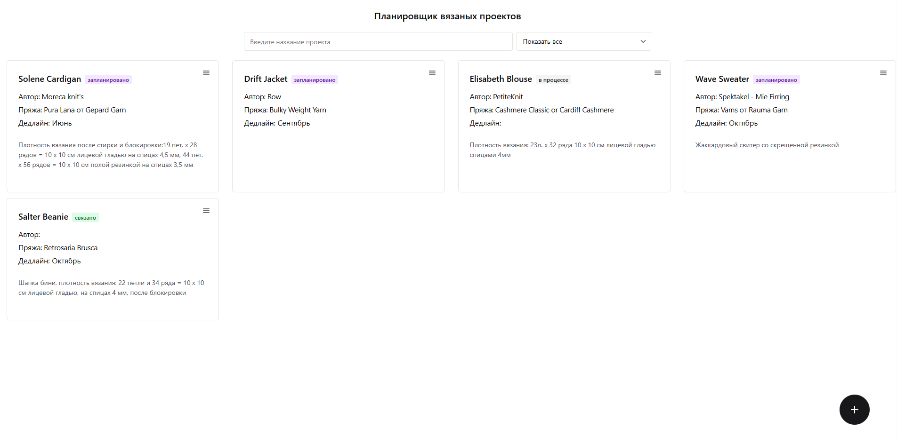
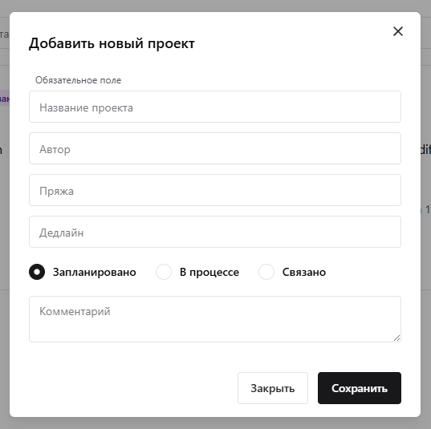

# Планировщик вязаных проектов

## Описание

Данный планировщик позволяет наглядно представить все запланированные проекты, находящиеся в процессе, а также уже готовые. Можно воспользоваться поиском и фильтром, добавлять, удалять и редактировать проекты. Данные наработки планирую использовать в своем мобильном приложении [KnittingAssistant](https://github.com/dar-b-r-b/KnittingAssistant)

## Установка

1. Клонируйте репозиторий:
   ```bash
   git clone https://github.com/dar-b-r-b/knitted-project-planner.git
   ```
2. Перейдите в директорию проекта:
   ```bash
   cd knitted-project-planner
   ```
3. Установите зависимости:
   ```bash
   npm install
   ```
   
## Использование

Для запуска выполните команду: 

```bash
npm start
```

## Интерфейс



